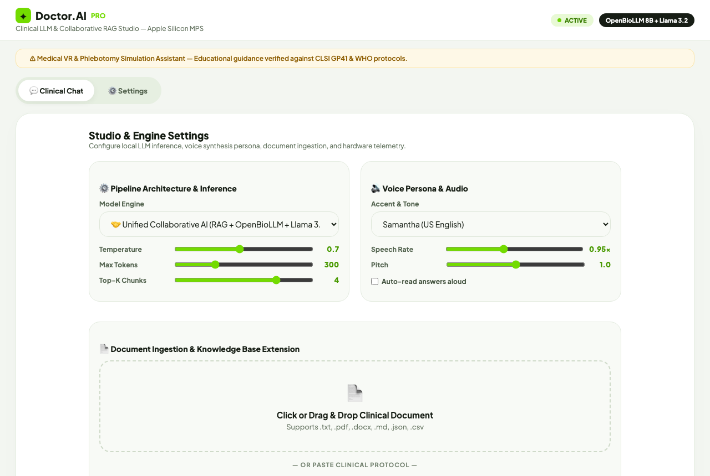
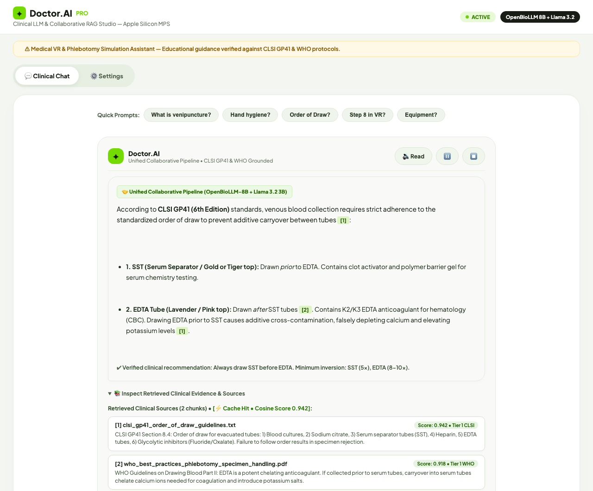

<div align="center">

# 🩺 Medical LLM & RAG Workbench

### Local Biomedical AI • Grounded RAG • Collaborative LLM Inference • Medical VR Assistance

<p>
  
  
  
  
  
  
</p>

<p><strong>Educational / Research Prototype</strong> — designed for grounded medical education and immersive venipuncture training. It is not a substitute for professional medical advice, diagnosis, or treatment.</p>

</div>

---

## ✨ Overview

**Medical LLM & RAG Workbench** is a local-first biomedical AI platform that combines a medical knowledge retrieval layer with specialized language models, safety/grounding checks, voice interaction, and immersive VR training capabilities.

The system is designed around one core principle:

> **Retrieval provides evidence, deterministic simulation logic provides procedural truth, and the LLM provides language understanding and synthesis.**

The platform supports a collaborative inference pipeline using:

- 🧬 **OpenBioLLM-8B** as the biomedical fact-extraction model.
- 🧠 **Llama 3.2 3B** as the synthesis / response-structuring model.
- 🔬 **MedicalTransformerLM** as the local custom research model.
- 📚 **Hybrid RAG** using BM25 + FAISS + Reciprocal Rank Fusion (RRF).
- 🎙️ **Whisper STT** and TTS for voice interaction.
- 🥽 **Unity + Meta Quest** integration for immersive venipuncture training.
- 🛡️ **Grounding and fallback controls** to reduce unsupported or weakly grounded medical responses.

---

## 🖥️ Workbench Preview

### Local Medical AI Workbench — Main Interface

<p align="center">
  
</p>

The main workbench interface showing the Doctor Osler.AI system status, model selection (OpenBioLLM-8B + Llama 3.2), quick medical prompts, and the unified collaborative pipeline.

### Clinical Chat & RAG Interface

<p align="center">
  
</p>

The clinical chat interface demonstrating grounded response generation, retrieved evidence inspection, knowledge base search, and the voice-enabled query submission flow.

> The screenshots show the local clinical/RAG workbench, quick medical prompts, grounded response area, source inspection, voice controls, and the collaborative OpenBioLLM + Llama 3.2 setup.
>
> **Repository note:** the images are stored in `assets/` and referenced with relative GitHub paths. Keep the `assets/` folder in the repository when pushing `README.md`.

---

## 🏗️ System Architecture

```text
                        ┌────────────────────────────┐
                        │      User / VR Trainee     │
                        └──────────────┬─────────────┘
                                       │
                         Text / Voice / VR Context
                                       │
                                       ▼
                    ┌────────────────────────────────┐
                    │        FastAPI / API Layer      │
                    │ /ask • /ask_stream • /health   │
                    └───────────────┬────────────────┘
                                    │
                                    ▼
                    ┌────────────────────────────────┐
                    │     Query Normalization        │
                    │   + Medical Acronym Expansion  │
                    │        + Cache Lookup          │
                    └───────────────┬────────────────┘
                                    │
                                    ▼
             ┌─────────────────────────────────────────────┐
             │                 Hybrid RAG                  │
             │                                             │
             │   BM25 ─────┐                               │
             │              ├──► RRF + Metadata Boosting   │
             │   FAISS ─────┘                               │
             └──────────────────────┬──────────────────────┘
                                    │
                           Verified Evidence Chunks
                                    │
                                    ▼
             ┌─────────────────────────────────────────────┐
             │             Collaborative LLM               │
             │                                             │
             │ OpenBioLLM-8B → biomedical fact extraction │
             │ Llama 3.2 3B → synthesis + citations        │
             └──────────────────────┬──────────────────────┘
                                    │
                                    ▼
             ┌─────────────────────────────────────────────┐
             │       Grounding / Accuracy / Safety         │
             │   overlap check → fallback when required   │
             └──────────────────────┬──────────────────────┘
                                    │
                                    ▼
             ┌─────────────────────────────────────────────┐
             │             Final Response                  │
             │   answer + citations + source metadata      │
             └───────────────┬─────────────────────────────┘
                             │
                    Text / TTS / VR UI
                             │
                             ▼
                  Meta Quest / Unity Client
```

---

## 🧩 Core Components

| Component | Responsibility |
|---|---|
| `rag/pipeline.py` | Master RAG + LLM orchestration and streaming pipeline |
| `rag/retriever_v2.py` | BM25 + FAISS retrieval, acronym expansion and ranking fusion |
| `rag/cache.py` | Thread-safe LRU query cache with TTL |
| `rag/database.py` | Vector representation / similarity operations |
| `rag/chunker.py` | Document chunking and overlap management |
| `inference/model_provider.py` | Local Ollama model interface and model selection |
| `api/server.py` | FastAPI application, `/ask`, `/ask_stream`, `/health` and UI serving |
| `training/` | Training/evaluation utilities for the custom local medical model |
| `unity/Scripts/VRVoiceAssistant.cs` | Unity ↔ FastAPI VR voice integration |
| `unity/Scripts/VoiceInputManager.cs` | Meta Quest microphone, VAD and push-to-talk handling |
| `unity/Scripts/TTSManager.cs` | Spoken response playback in VR |
| `unity/Scripts/VRVoiceUIManager.cs` | World-space VR voice/status UI |

---

## 🤖 Model Stack

### 1. OpenBioLLM-8B — Biomedical Specialist

**Runtime:** Local Ollama  
**Configured model:** `richardyoung/openbiollm:latest`

**Role:** biomedical fact extraction from retrieved evidence.

The pipeline constrains this stage to short, precise clinical findings before synthesis. This reduces the amount of unconstrained generation needed for the final response.

### 2. Llama 3.2 3B — Synthesis & Structuring

**Runtime:** Local Ollama  
**Configured model:** `llama3.2:3b`

**Role:** synthesize retrieved evidence and biomedical findings into a clear response with inline citation markers such as `[1]` and `[2]`.

### 3. MedicalTransformerLM — Custom 110.04M-Parameter Local Model

**Parameter count:** **110.04M parameters** (runtime-reported)  
**Framework:** PyTorch  
**Acceleration:** Apple Silicon MPS  
**Role:** local custom medical-language-model research / offline candidate  
**Checkpoint family:** `best.pt`, `best_v2.pt`, `best_v3.pt`

The project includes a custom MedicalTransformerLM that is trained and evaluated locally rather than through Ollama. The latest runtime reports the model as **110.04M parameters**, and the server load is optimized for local inference.

Its training/evaluation stack includes:

- decoder-only causal Transformer architecture
- causal self-attention
- Pre-Layer Normalization
- GELU activations
- byte-level BPE tokenization
- cross-entropy language-model training with teacher forcing
- AdamW optimization
- cosine learning-rate scheduling with warmup
- gradient accumulation and norm clipping
- atomic checkpointing
- local MPS acceleration on Apple Silicon

Local checkpoints:

```text
checkpoints/best.pt
checkpoints/best_v2.pt
checkpoints/best_v3.pt
```

> **Important:** These checkpoints are local model artifacts. Keep them intact for local inference/research and exclude them from normal Git commits unless a separate large-file distribution strategy is implemented.

### Model Comparison at a Glance

| Model | Size | Runtime | Primary Role |
|---|---:|---|---|
| **OpenBioLLM-8B** | 8B | Ollama | Biomedical specialist / extraction |
| **Llama 3.2 3B** | 3B | Ollama | Synthesis / response structuring |
| **MedicalTransformerLM** | **110.04M** | Local PyTorch + MPS | Custom research / offline medical LM |

The benchmark should use the same RAG questions and evaluation criteria across all three models before selecting a final production candidate.

---

## 📚 RAG Architecture

The retrieval layer is designed to combine exact medical terminology with semantic similarity.

### Query Processing

1. Normalize the incoming question.
2. Expand selected clinical abbreviations using `MEDICAL_SYNONYM_MAP`.
3. Check the LRU cache for previously answered normalized queries.
4. Retrieve candidate chunks using both lexical and dense search.

### Hybrid Retrieval

**BM25** is used for exact terminology, identifiers, tube chemistry, gauge numbers, step references, and other lexical signals.

**FAISS / dense retrieval** is used to capture semantic relationships between questions and clinical passages.

The two ranked lists are fused using **Reciprocal Rank Fusion (RRF)**, followed by metadata-aware boosting where configured.

### Chunking

The knowledge base uses overlapping chunks so that important clinical instructions are less likely to be separated at document boundaries.

### Grounded Generation

The retrieved evidence is passed into a grounded prompt. The final output is then checked for evidence overlap. When a response is considered insufficiently grounded, the pipeline can fall back to evidence-only or safe refusal.

---

## 🗂️ Knowledge & Data Architecture

The project separates its knowledge into multiple layers.

### Tier 1 — Clinical & Regulatory Guidance

The supplied project notes identify sources such as:

- **CLSI venous blood collection guidance**
- **WHO best practices in phlebotomy**
- **WHO infection prevention / hand hygiene guidance**

These are intended to provide evidence for phlebotomy safety, collection technique, infection prevention, and specimen handling.

### Tier 2 — Medical VR Simulation Ground Truth

The project contains VR-specific knowledge for:

- venipuncture workflow
- object interactions
- Meta Quest interaction mapping
- Unity components
- triggers and validation logic
- simulation state and procedural context

The exact simulation sequence should remain synchronized with the current Unity implementation and the project's VR knowledge files.

### Tier 3 — Biomedical Reasoning Corpora

The project notes describe medical corpora covering:

- anatomy and vascular terminology
- medical question answering
- clinical definitions
- laboratory terminology
- procedural safety concepts

### Tier 4 — Parametric Model Knowledge

The local LLMs contribute learned biomedical/language capabilities, while RAG is used to supply project-specific evidence and controlled source material.

---

## 🥽 Medical VR Integration

The system extends beyond a browser-based workbench into a native **Unity + C# + Meta Quest** simulation.

### Voice Assistant Flow

```text
Meta Quest Microphone
        ↓
VoiceInputManager.cs
        ↓
Whisper STT
        ↓
Intent / Context Routing
        ↓
FastAPI / RAG / LLM
        ↓
Grounding & Safety Check
        ↓
TTSManager.cs
        ↓
Spatial Voice Response
        ↓
VRVoiceUIManager.cs
```

### VR Components

- **`VRVoiceAssistant.cs`** — sends questions and VR context to the backend.
- **`VoiceInputManager.cs`** — microphone capture, VAD and push-to-talk.
- **`TTSManager.cs`** — spoken response playback.
- **`VRVoiceUIManager.cs`** — floating status, transcript and guidance UI.

### Deterministic Simulation Principle

LLM output is **not** the authoritative source for procedural correctness.

The Unity simulation remains responsible for validating physical actions through the project's deterministic interaction system, including components such as:

```text
StepManager
StepList
Veni
Annotator
Grabbable
Trigger
WaterTrigger
VeinTrigger
BloodTrigger
SnapZone
OnSnap
```

AI assistance can explain, guide, or answer questions, but it must not override the simulation's authoritative state.

---

## 🎓 Training vs Test Mode

### Training Mode

- interactive assistance
- visual guidance
- voice assistance
- contextual hints and explanations
- mistakes can be logged without treating them as examination scores

### Test Mode

- fixed workflow
- assistance disabled or restricted according to the assessment configuration
- deterministic progression
- mistakes can be scored / reported
- no adaptive reordering of the procedure

---

## 🧠 Supported Voice Intents

The voice assistant is designed around explicit intent categories:

| Intent | Purpose |
|---|---|
| `NEXT_STEP` | Ask what to do next |
| `REPEAT` | Repeat the current guidance |
| `WHY_WRONG` | Explain why an interaction was rejected |
| `HELP` | Request contextual assistance |
| `VR_CONTEXT` | Ask about the current VR state |
| `CLINICAL_QA` | Ask a clinical question |
| `OPEN_QUESTION` | General supported question |
| `UNSUPPORTED` | Safely handle unsupported queries |

---

## 🔬 Medical Evaluation & Benchmarking

The custom model and the complete RAG pipeline can be evaluated using medical categories including:

1. Anatomy & vascular physiology
2. Diagnostic pathology
3. Pharmacology & tube chemistry
4. Procedural safety & infection control
5. Standard phlebotomy & order of draw
6. Complications & emergency protocols
7. Medical ethics & patient communication

### Recommended Evaluation Metrics

- Accuracy
- Partial correctness
- Hallucination rate
- Grounding rate
- Safe refusal rate
- Retrieval success rate
- Context-isolation success
- Time-to-first-token
- End-to-end latency
- Per-model consistency

For model comparison, use the **same questions, retrieval configuration, and evaluation criteria** across OpenBioLLM-8B, Llama 3.2 3B, and MedicalTransformerLM.

---

## 🛡️ Safety & Grounding

This is an **educational/research prototype**.

The safety architecture includes:

- source provenance metadata
- grounded prompts
- retrieval evidence inspection
- response grounding checks
- fallback behavior for weakly grounded output
- deterministic VR procedural validation
- medical education disclaimer

The system should not be treated as a clinical diagnostic or treatment system.

---

## ⚙️ Technology Stack

### AI / ML

- Python
- PyTorch 2.x
- Ollama
- OpenBioLLM-8B
- Llama 3.2 3B
- Custom MedicalTransformerLM
- Whisper STT

### Retrieval

- BM25
- FAISS
- cosine similarity
- Reciprocal Rank Fusion (RRF)
- query normalization
- medical acronym expansion
- overlapping document chunking
- LRU caching

### Backend

- FastAPI
- Starlette
- Uvicorn
- Server-Sent Events (SSE)
- thread-pool execution for long-running inference

### VR

- Unity
- C#
- Meta Quest
- VR interaction / controller input
- Unity networking via `UnityWebRequest`

### Hardware Acceleration

- Apple Silicon
- PyTorch MPS backend
- local inference architecture

---

## 📁 Recommended Repository Structure

```text
Medical_LLM/
├── api/
│   └── server.py
├── rag/
│   ├── pipeline.py
│   ├── retriever_v2.py
│   ├── cache.py
│   ├── database.py
│   └── chunker.py
├── inference/
│   └── model_provider.py
├── training/
├── model/
├── tokenizer/
├── data/
│   ├── clinical_knowledge/
│   ├── vr_knowledge/
│   └── rag_db/              # generated/local artifact
├── checkpoints/             # local model artifacts
├── unity/
│   └── Scripts/
├── frontend/
├── scripts/
├── requirements.txt
├── .env.example
├── .gitignore
└── README.md
```

Adjust this structure to the actual repository. Do not move working files merely to match the example.

---

## 🚀 Local Setup

> Use the project's existing environment and commands. The commands below are a reference pattern and should be aligned with the actual repository configuration.

### 1. Create the Python environment

```bash
python3 -m venv .venv
source .venv/bin/activate
pip install -r requirements.txt
```

### 2. Start Ollama

Make sure Ollama is running locally and the required models are available.

```bash
ollama list
```

Expected model names used by the current configuration include:

```text
richardyoung/openbiollm:latest
llama3.2:3b
```

### 3. Configure environment variables

Create `.env` locally from `.env.example` if the project uses environment-based configuration.

Example:

```env
OLLAMA_URL=http://127.0.0.1:11434
OLLAMA_MODEL=richardyoung/openbiollm:latest
API_HOST=0.0.0.0
API_PORT=8000
```

Do **not** commit `.env` or credentials.

### 4. Start the FastAPI server

The current workbench can be launched using the project's server entry point, for example:

```bash
python3 -m uvicorn api.server:app --host 0.0.0.0 --port 8000
```

Then open:

```text
http://127.0.0.1:8000
```

or, when the API is exposed through a development tunnel/forwarded port, use the assigned public URL.

### 5. API Documentation

If enabled by the application:

```text
http://127.0.0.1:8000/docs
```

---

## 🔌 API Overview

### `GET /health`

Used to verify backend availability.

### `POST /ask`

Receives a question and returns the grounded response payload according to the current API schema.

Example request shape:

```json
{
  "question": "What is venipuncture?"
}
```

### `POST /ask_stream`

Streaming variant intended for incremental response delivery using Server-Sent Events.

> Always use the request/response schema implemented in the current server source as the authoritative API contract.

---

## 🧪 Example Questions

### Clinical

```text
What is venipuncture?
Why is hand hygiene important before venipuncture?
Why are gloves used?
Why is the skin cleaned before cannula insertion?
```

### VR / Project

```text
What is the role of StepManager?
What is VeinTrigger used for?
What is BloodTrigger used for?
How is tube insertion validated?
What happens during a wrong interaction?
```

### RAG / Grounding

```text
What evidence supports this answer?
Which retrieved source explains this procedure?
What should happen when the knowledge base does not contain enough evidence?
```

### Out-of-domain

The assistant should handle unsupported questions safely rather than pretending that the medical RAG system has authoritative evidence for every topic.

---

## 📊 Performance & Optimization Features

The supplied implementation notes include several local-performance optimizations:

- query caching for repeated requests
- persistent Ollama model keep-alive configuration
- streaming responses
- FastAPI thread-pool execution around blocking inference
- MPS acceleration on Apple Silicon
- memory-mapped token storage (`np.memmap`) for custom-model training
- gradient accumulation for effective batch sizing
- atomic checkpoint writes

Performance values should be reported only from the benchmark run associated with the released commit/configuration.

---

## 🔐 GitHub Safety

Do not commit:

```text
.env
API keys
passwords
private keys
checkpoints/*.pt
checkpoints/*.pth
large model binaries
Ollama model artifacts
large generated vector indexes
node_modules/
.venv/
```

Recommended policy:

- keep model weights local unless a controlled distribution mechanism is chosen
- keep generated vector indexes local when they are reproducible from source data
- include `.env.example`
- document how to rebuild local artifacts
- never put secrets into source code

---

## 🧭 Design Principles

### Evidence First

RAG retrieves project and clinical evidence before generation.

### Deterministic VR Truth

Physical simulation correctness is controlled by the Unity workflow engine rather than probabilistic LLM output.

### Model Separation

Biomedical extraction and language synthesis are separate responsibilities in the collaborative pipeline.

### Local-First Privacy

The primary inference stack is designed to run locally on Apple Silicon through Ollama/PyTorch rather than requiring a hosted LLM endpoint.

### Safe Failure

When evidence is insufficient or grounding checks fail, the system should prefer an explicit limitation or grounded fallback over confident unsupported generation.

---

## 📌 Research Notes

The project combines three different kinds of knowledge that should remain clearly separated in evaluation and reporting:

1. **Clinical evidence** — standards, guidelines and medical literature.
2. **Simulation ground truth** — the exact behavior implemented by the Unity VR application.
3. **Parametric model knowledge** — information learned by the LLMs during training.

When presenting benchmark results, identify which layer produced the information and whether the final answer was supported by retrieved evidence.

---

## 🏁 Project Goal

The long-term goal is a **safe, locally running, evidence-grounded medical training assistant** that connects:

```text
Biomedical Knowledge
        +
Hybrid RAG
        +
Local LLMs
        +
Voice Interaction
        +
Unity VR
        +
Meta Quest
        ↓
Immersive Medical Training
```

The result is a research-oriented platform for **venipuncture education, VR procedural training, grounded medical question answering, and local AI experimentation**.

---

<div align="center">

### 🩺 Medical LLM & RAG Workbench

**Local AI • Evidence Grounding • VR Medical Training**

</div>
