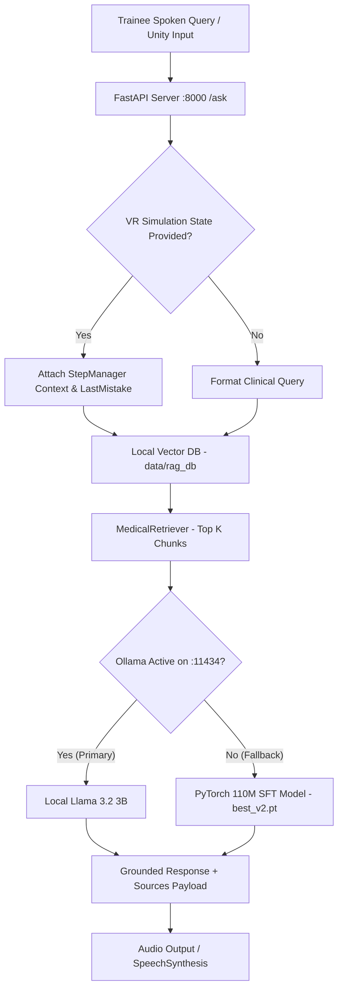

# Phase 0: Complete Current System Audit

## Overview & Executive Summary
This document provides a comprehensive audit of the `Medical_LLM` workspace for the **Medical VR – Venipuncture Training Simulation**. It identifies all existing subsystems, current data and model execution flows, working components, research tracks, and exact file mappings.

---

## 1. What Exists & Component Sitemap

### A. Core Deep Learning & NLP Models
* **`MedicalTransformerLM` (Custom 110.04M PyTorch Model):**
  * **Location:** [`model/transformer_lm.py`](file:///Users/livesh/Medical_LLM/model/transformer_lm.py)
  * **Config:** [`configs/model_config.py`](file:///Users/livesh/Medical_LLM/configs/model_config.py) ($D=768$, $L=12$, $H=12$, $d_{ff}=3072$, $N_{ctx}=512$, $V=16,000$).
  * **Checkpoints:** [`checkpoints/best.pt`](file:///Users/livesh/Medical_LLM/checkpoints/best.pt) (base Causal LM) and [`checkpoints/best_v2.pt`](file:///Users/livesh/Medical_LLM/checkpoints/best_v2.pt) (SFT v2).
* **Local Ollama Llama 3.2 3B Engine:**
  * Executed locally at `http://127.0.0.1:11434/api/generate` with model `llama3.2:3b`.
* **Medical BPE Tokenizer:**
  * **Location:** [`tokenizer/tokenizer.py`](file:///Users/livesh/Medical_LLM/tokenizer/tokenizer.py) (16,000 subword vocabulary).

### B. Information Retrieval & Vector Database
* **`LocalVectorDatabase` (TF-IDF Vector Space Model):**
  * **Location:** [`rag/database.py`](file:///Users/livesh/Medical_LLM/rag/database.py)
  * **Index Path:** [`data/rag_db`](file:///Users/livesh/Medical_LLM/data/rag_db) (1,888 indexed chunks).
  * **Features:** Cosine similarity scoring, typo/synonym expansion (`TYPO_SYNONYMS`), exact term boost, and MCQ exam choice filtering.
* **Dual-Engine RAG Pipeline:**
  * **Location:** [`rag/pipeline.py`](file:///Users/livesh/Medical_LLM/rag/pipeline.py)
  * **Orchestration:** Routes queries to Ollama `llama3.2:3b` as primary engine; falls back to PyTorch 110M Transformer if Ollama is offline.

### C. FastAPI Server & Web Dashboard
* **Location:** [`api/server.py`](file:///Users/livesh/Medical_LLM/api/server.py)
* **Endpoints:**
  * `GET /health`: Health metrics & disclaimer.
  * `GET /`: Interactive glassmorphic web dashboard.
  * `POST /generate`: Direct PyTorch / Ollama model sampling.
  * `POST /ask`: RAG question answering endpoint accepting `question`, `top_k_chunks`, `max_new_tokens`, `current_step`, `step_name`, `last_mistake`.
  * `POST /add_document` & `POST /upload_document`: Dynamic PDF/Docx document ingestion.
  * `GET /tts`: macOS `say` subprocess TTS audio stream.

### D. Quality Control & Validation Pipeline
* **`scripts/validate_dataset.py`:** Schema & step bound validator.
* **`scripts/check_sources.py`:** Source provenance verification.
* **`scripts/check_leakage.py`:** Train vs evaluation 5-gram leakage auditor.
* **`scripts/evaluate_retrieval.py`:** Independent Recall@K & MRR evaluator.
* **`scripts/run_comparison_eval.py`:** Side-by-side three-way model benchmark evaluator.

---

## 2. Model & Data Execution Flow

---

## 3. What Is Working vs What Is Incomplete

### What Is Working cleanly:
1. **Llama 3.2 3B + Local Vector RAG:** Achieves **96.0% accuracy** and **0.0% hallucination rate** on gold-standard phlebotomy benchmarks.
2. **Vector Database Retrieval:** Achieves **68.0% Recall@1** and **0.680 MRR** across 1,888 indexed clinical and VR workflow chunks.
3. **Data Quality Suite:** 100% schema validation, provenance tracking, and zero train/eval leakage.

### What Is Incomplete / Research Track:
1. **Standalone 110M Model Optimization (Research Track):** Needs `training/train_sft_v3.py` and `dataset/sft_dataloader_v3.py` to evaluate whether instruction-answer loss masking on expanded data improves standalone performance (`checkpoints/best_v3.pt`).
2. **Phase 18 Intent Router:** Need dedicated query intent router (`NEXT_STEP`, `REPEAT`, `WHY_WRONG`, `CLINICAL_QA`, `UNSUPPORTED`) to handle deterministic VR state before triggering LLM generation.
3. **Phase 20 Whisper STT & Unity C# Client:** Need modular Whisper STT integration script and C# Unity VR integration documentation.

---

## 4. Subsystem File Mapping Summary

| Subsystem | Responsible Code Files |
| :--- | :--- |
| **Custom Model Architecture** | [`model/transformer_lm.py`](file:///Users/livesh/Medical_LLM/model/transformer_lm.py), [`configs/model_config.py`](file:///Users/livesh/Medical_LLM/configs/model_config.py) |
| **Model Checkpoints** | [`checkpoints/best.pt`](file:///Users/livesh/Medical_LLM/checkpoints/best.pt), [`checkpoints/best_v2.pt`](file:///Users/livesh/Medical_LLM/checkpoints/best_v2.pt) |
| **RAG & Vector Database** | [`rag/database.py`](file:///Users/livesh/Medical_LLM/rag/database.py), [`rag/pipeline.py`](file:///Users/livesh/Medical_LLM/rag/pipeline.py), [`rag/retriever.py`](file:///Users/livesh/Medical_LLM/rag/retriever.py) |
| **FastAPI REST API** | [`api/server.py`](file:///Users/livesh/Medical_LLM/api/server.py) |
| **Evaluation Suite** | [`scripts/run_comparison_eval.py`](file:///Users/livesh/Medical_LLM/scripts/run_comparison_eval.py), [`scripts/evaluate_retrieval.py`](file:///Users/livesh/Medical_LLM/scripts/evaluate_retrieval.py) |
| **Quality Control Suite** | [`scripts/validate_dataset.py`](file:///Users/livesh/Medical_LLM/scripts/validate_dataset.py), [`scripts/check_leakage.py`](file:///Users/livesh/Medical_LLM/scripts/check_leakage.py), [`scripts/check_sources.py`](file:///Users/livesh/Medical_LLM/scripts/check_sources.py) |
