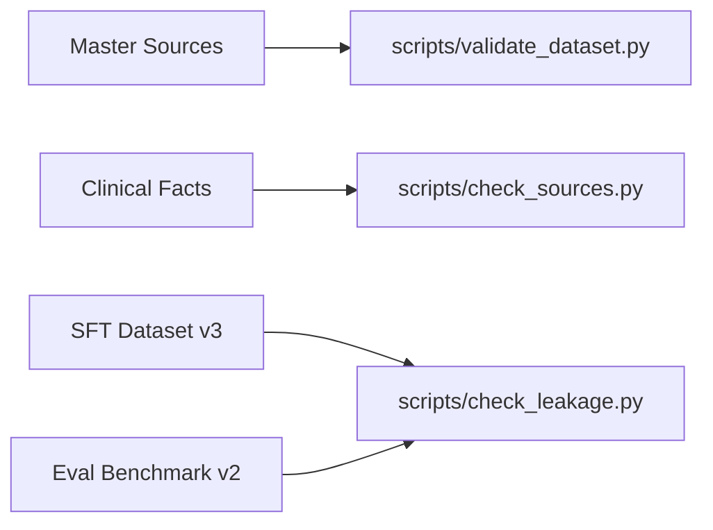

# Data Pipeline & Quality Control Architecture

## Overview
This document outlines the canonical data extraction, normalization, validation, and leakage prevention pipeline for the AI-Enhanced VR Venipuncture Training System.

---

## 1. Directory Structure

```text
data/
├── sources/               # Raw and extracted clinical guideline documents
├── clinical_knowledge/    # Verified clinical facts with WHO/CLSI provenance
├── vr_knowledge/          # Deterministic 16-step VR simulation workflow metadata
├── sft/                   # Supervised Fine-Tuning datasets (v3 & voice queries)
├── evaluation/            # Untouched gold-standard evaluation benchmarks (v2)
├── conflicts/             # Conflict logs for flagged clinical contradictions
└── metadata/              # Master source registry (sources.json)
```

---

## 2. Automated Quality Control & Validation Suite



1. **Schema Validation (`scripts/validate_dataset.py`):**
   * Verifies required JSON fields, valid data types, step bounds (0–16), and unhandled dictionary wrappers.
2. **Provenance Audit (`scripts/check_sources.py`):**
   * Ensures every clinical record maps to a registered source ID in `data/metadata/sources.json`.
3. **Leakage Audit (`scripts/check_leakage.py`):**
   * Performs exact string matching and 5-gram sub-phrase overlap analysis to guarantee 0% data leakage between training files and evaluation benchmarks.
