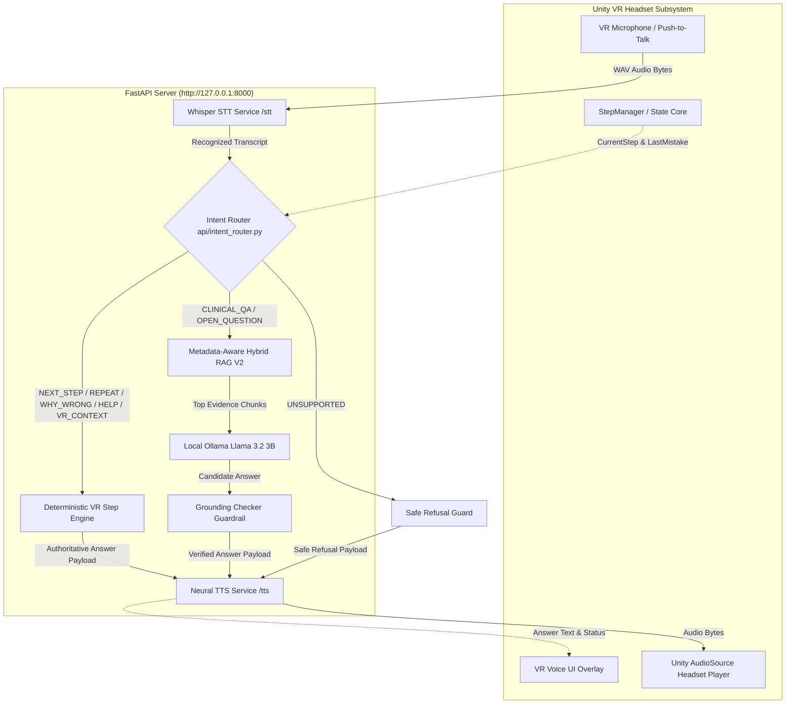

# End-to-End Voice Assistant & VR Architecture

## 1. System Overview

The voice assistant provides real-time phlebotomy guidance and clinical question answering inside the Medical VR Venipuncture Training Simulation.

---

## 2. Deterministic VR Core Immutability Guardrail

The C# simulation core components (`StepManager`, `Veni`, `StepList`, `Annotator`, `Grabbable`, `Trigger`, `SnapZone`) remain the sole authoritative source of truth for procedure logic and state progression.

- **Rule 1**: The LLM engine **never** decides or updates `StepManager.CurrentStep`.
- **Rule 2**: Deterministic voice queries (`NEXT_STEP`, `REPEAT`, `WHY_WRONG`, `HELP`, `VR_CONTEXT`) bypass LLM generation entirely and read direct state from `venipuncture_16_steps.json`.
- **Rule 3**: In **Test Mode**, the voice assistant is automatically disabled to evaluate unassisted trainee proficiency.
