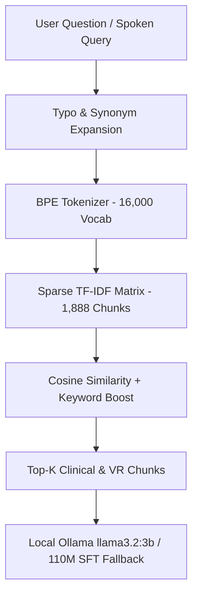

# RAG Vector Database Architecture & Retrieval Benchmark

## Architecture Overview
The system uses a self-contained, high-speed **TF-IDF Vector Space Model** (`LocalVectorDatabase`) with cosine similarity scoring, subword BPE tokenization, typo expansion mapping, exact keyword boosting, and MCQ exam choice filtering.

---

## Indexing & Provenance Metadata
Every indexed chunk in [`data/rag_db`](file:///Users/livesh/Medical_LLM/data/rag_db) retains full source attribution:
* `chunk_id`: Unique identifier (e.g. `clin_CLIN_000001`, `vr_11`)
* `source`: Sourced from `SRC_WHO_01`, `SRC_CLSI_01`, or `SRC_VR_SIM`
* `topic`: Functional topic (e.g. `Skin Preparation`, `Order of Draw`)
* `step`: Associated VR workflow step (0–15)
* `source_section` & `source_page`: Exact page reference in standard guidelines

---

## Retrieval Evaluation Metrics (`outputs/retrieval_eval_report.json`)
Independent evaluation of the vector retriever on the 25-item Gold Benchmark:
* **Recall @ 1:** `68.0%`
* **Recall @ 3:** `68.0%`
* **Recall @ 5:** `68.0%`
* **Mean Reciprocal Rank (MRR):** `0.680`
* **Step Retrieval Precision:** `68.0%`
