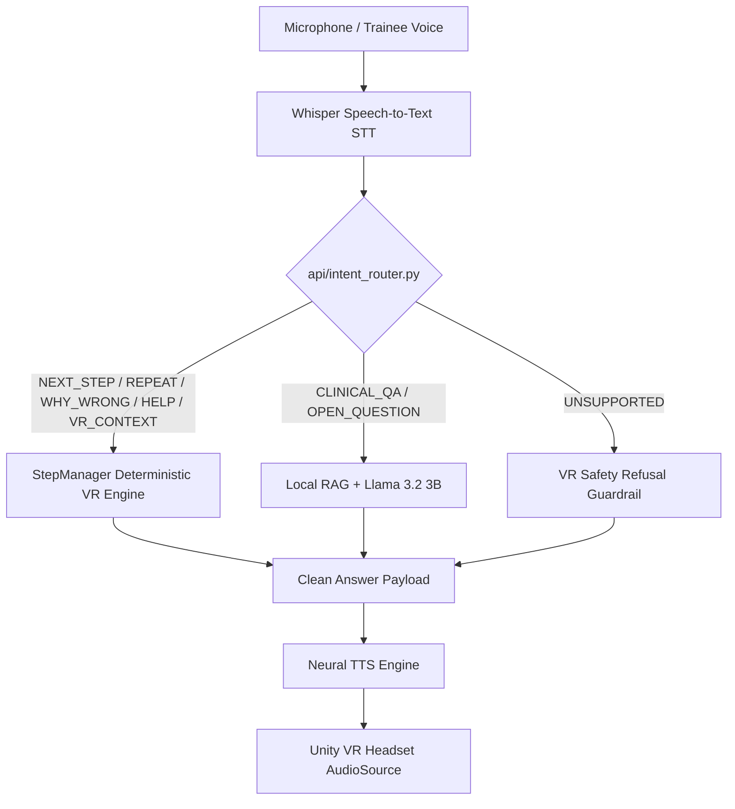

# Voice Pipeline & Intent Router Architecture

## Architecture Overview
The voice assistant subsystem combines Speech-to-Text (STT), deterministic intent classification, vector RAG retrieval, LLM synthesis, and Text-to-Speech (TTS) output.

---

## 1. Intent Router Routing Logic ([`api/intent_router.py`](file:///Users/livesh/Medical_LLM/api/intent_router.py))
* **`NEXT_STEP`:** Returns current step name & description directly from `CurrentStep` without LLM call.
* **`REPEAT`:** Repeats current active step instructions.
* **`WHY_WRONG`:** Explains `LastMistake` logged by C# `StepManager`.
* **`HELP`:** Directs trainee to the `Annotator` target glow.
* **`UNSUPPORTED`:** Safe refusal (*"This information is not provided in the current simulation."*).
* **`CLINICAL_QA`:** Queries RAG Vector DB $\to$ synthesizes answer via Llama 3.2 3B.
